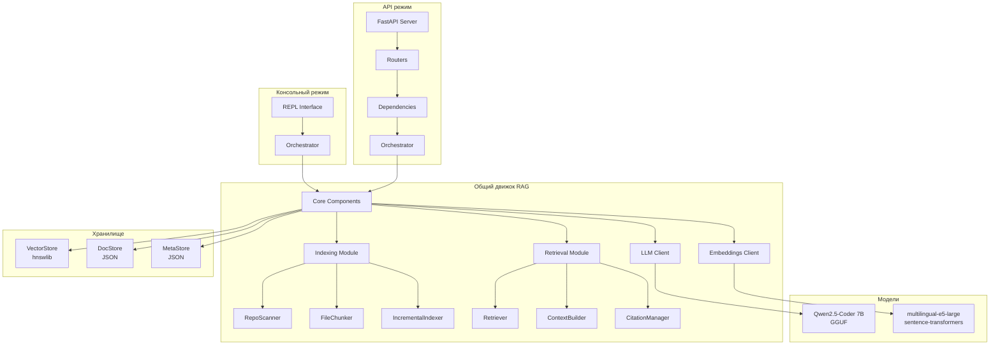
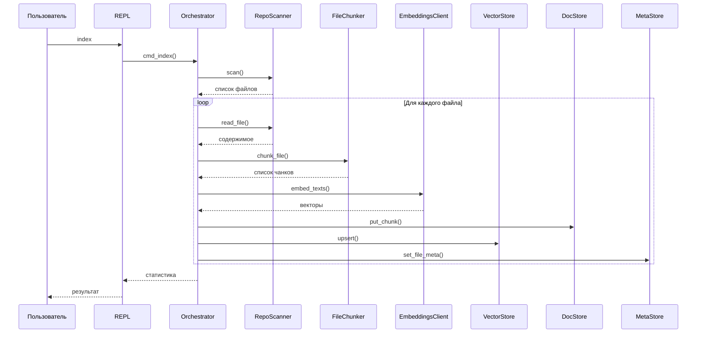
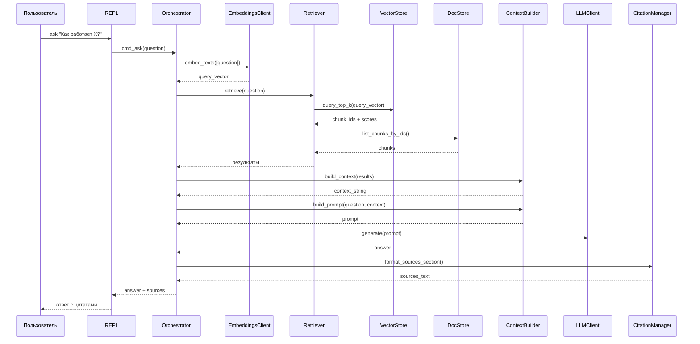
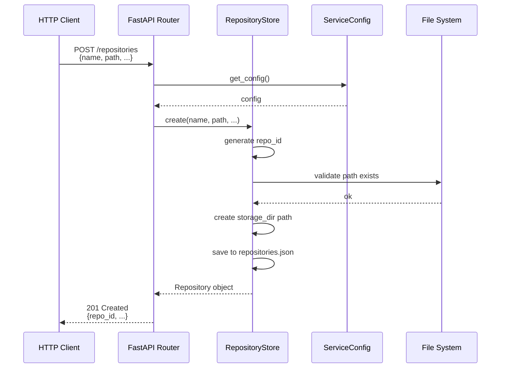
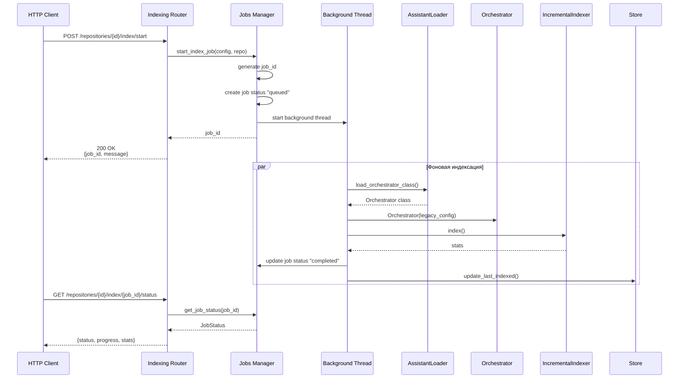
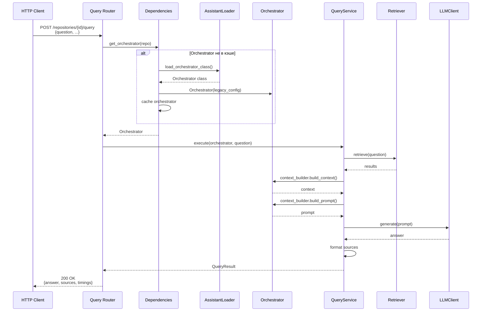
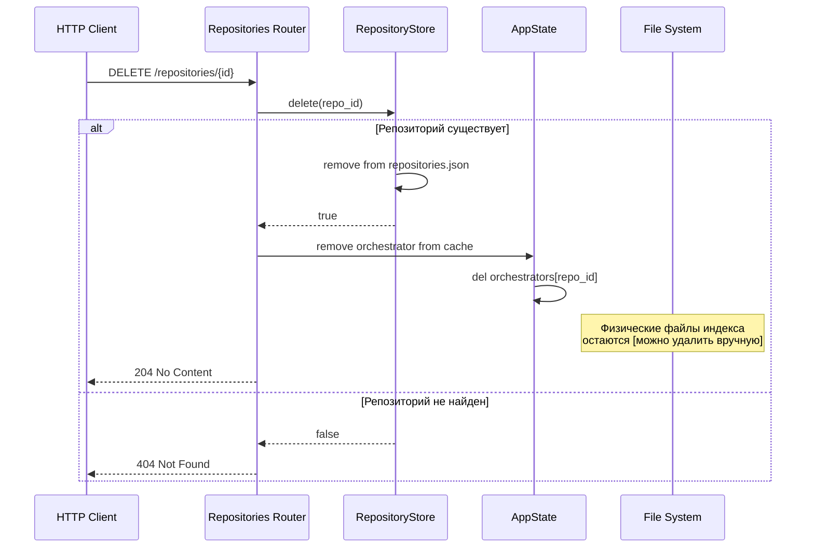
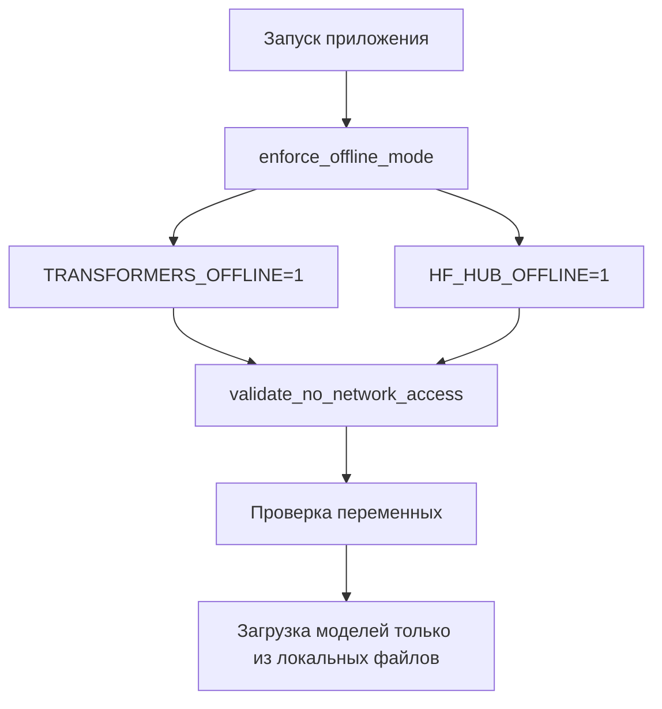
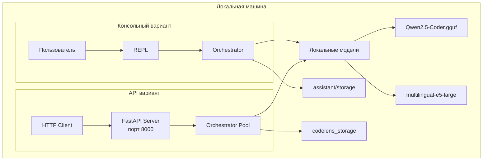

# Архитектура CodeLens RAG-системы

## Обзор

CodeLens — локальная RAG-система для работы с кодовыми базами. Поддерживает два режима работы:

1. **Консольный (REPL)** — `local_repo_assistant` — интерактивная работа с одним репозиторием
2. **API (FastAPI)** — `ml-service` — HTTP-сервис для работы с множеством репозиториев

Оба варианта используют общий движок RAG из `local_repo_assistant`.

---

## Общая архитектура

### Компонентная диаграмма



### Слои архитектуры

```
┌─────────────────────────────────────────────────────────┐
│  Интерфейсный слой                                       │
│  ┌──────────────┐          ┌──────────────┐             │
│  │ REPL (CLI)   │          │ FastAPI      │             │
│  └──────┬───────┘          └──────┬───────┘             │
└─────────┼──────────────────────────┼─────────────────────┘
          │                          │
┌─────────┼──────────────────────────┼─────────────────────┐
│         │      Оркестратор         │                      │
│         └──────────┬───────────────┘                       │
│                    │                                      │
│  ┌─────────────────┼─────────────────┐                   │
│  │  Индексация     │    Retrieval     │                   │
│  │  - Scanner      │    - Retriever   │                   │
│  │  - Chunker      │    - Context     │                   │
│  │  - Indexer      │    - Citations   │                   │
│  └─────────────────┼─────────────────┘                   │
│                    │                                      │
│  ┌─────────────────┼─────────────────┐                   │
│  │  LLM Client     │  Embeddings     │                   │
│  │  (llama-cpp)    │  (sentence-      │                   │
│  │                 │   transformers)  │                   │
│  └─────────────────┴─────────────────┘                   │
└────────────────────────────────────────────────────────────┘
          │                          │
┌─────────┼──────────────────────────┼─────────────────────┐
│         │      Хранилище           │                      │
│  ┌──────▼──────┐  ┌──────▼──────┐  ┌──────▼──────┐      │
│  │ VectorStore │  │  DocStore   │  │  MetaStore │      │
│  │  (hnswlib)  │  │   (JSON)    │  │   (JSON)    │      │
│  └─────────────┘  └─────────────┘  └─────────────┘      │
└───────────────────────────────────────────────────────────┘
```

---

## Консольный вариант (local_repo_assistant)

### Структура

```
local_repo_assistant/
├── app/
│   ├── main.py          # Точка входа
│   ├── repl.py          # REPL интерфейс
│   ├── orchestrator.py  # Главный координатор
│   └── config.py        # Конфигурация
├── core/
│   └── interfaces.py    # Базовые интерфейсы
├── indexing/            # Модуль индексации
├── retrieval/           # Модуль поиска
├── llm/                 # LLM клиент
├── embeddings/          # Embeddings клиент
└── storage/             # Хранилища
```

### Поток данных: Индексация



### Поток данных: Запрос (RAG)



---

## API вариант (ml-service)

### Структура

```
services/ml-service/
├── app/
│   ├── main.py              # FastAPI приложение
│   ├── routers/             # API эндпоинты
│   │   ├── repositories.py  # Управление репозиториями
│   │   ├── indexing.py      # Индексация
│   │   └── query.py         # Запросы
│   ├── dependencies.py       # DI контейнер
│   ├── jobs.py              # Фоновые задачи
│   ├── repositories.py      # Хранилище репозиториев
│   └── assistant_loader.py  # Загрузчик из local_repo_assistant
└── run.py                   # Точка входа
```

### Поток данных: Добавление репозитория



### Поток данных: Индексация (API)



### Поток данных: Запрос (API)



### Поток данных: Удаление репозитория



---

## Сравнение вариантов

| Аспект | Консольный (REPL) | API (FastAPI) |
|--------|-------------------|---------------|
| **Интерфейс** | Интерактивная консоль | HTTP REST API |
| **Репозитории** | Один (из config.json) | Множество (через API) |
| **Индексация** | Синхронная | Асинхронная (фоновые задачи) |
| **Запросы** | Интерактивные команды | HTTP POST/GET |
| **Хранилище** | `.assistant/storage/` | `.codelens_storage/{repo_id}/` |
| **Конфигурация** | `.assistant/config.json` | `.assistant/config.json` + per-repo настройки |
| **Использование** | Локальная разработка | Интеграция с другими сервисами |

---

## Жизненный цикл данных

### Индексация

```
┌─────────────────────────────────────────────────────────┐
│ 1. Сканирование                                          │
│    RepoScanner → список файлов                          │
└──────────────────┬──────────────────────────────────────┘
                   │
┌──────────────────▼──────────────────────────────────────┐
│ 2. Чанкинг                                               │
│    FileChunker → разбиение на чанки                      │
│    (chunk_size_lines, chunk_overlap_lines)              │
└──────────────────┬──────────────────────────────────────┘
                   │
┌──────────────────▼──────────────────────────────────────┐
│ 3. Создание эмбеддингов                                  │
│    EmbeddingsClient → векторы для каждого чанка         │
└──────────────────┬──────────────────────────────────────┘
                   │
┌──────────────────▼──────────────────────────────────────┐
│ 4. Сохранение                                            │
│    ├─ DocStore → тексты чанков + метаданные             │
│    ├─ VectorStore → векторы (hnswlib индекс)            │
│    └─ MetaStore → метаданные файлов (mtime, hash)        │
└──────────────────────────────────────────────────────────┘
```

### Запрос (RAG)

```
┌─────────────────────────────────────────────────────────┐
│ 1. Вопрос пользователя                                  │
│    "Как работает авторизация?"                         │
└──────────────────┬──────────────────────────────────────┘
                   │
┌──────────────────▼──────────────────────────────────────┐
│ 2. Поиск релевантных чанков                              │
│    EmbeddingsClient → embedding вопроса                  │
│    VectorStore → top-K ближайших векторов                │
│    DocStore → получение текстов чанков                   │
└──────────────────┬──────────────────────────────────────┘
                   │
┌──────────────────▼──────────────────────────────────────┐
│ 3. Построение контекста                                  │
│    ContextBuilder → объединение чанков                   │
│    → промпт для LLM                                      │
└──────────────────┬──────────────────────────────────────┘
                   │
┌──────────────────▼──────────────────────────────────────┐
│ 4. Генерация ответа                                       │
│    LLMClient → генерация текста                          │
│    CitationManager → форматирование источников          │
└──────────────────┬──────────────────────────────────────┘
                   │
┌──────────────────▼──────────────────────────────────────┐
│ 5. Ответ пользователю                                    │
│    Текст + источники в формате path:start-end           │
└──────────────────────────────────────────────────────────┘
```

---

## Структура хранилища

### Консольный вариант

```
.assistant/
├── config.json                    # Конфигурация
└── storage/
    ├── docstore/
    │   └── chunks.json           # Тексты чанков
    ├── vectorstore/
    │   ├── hnsw_index.bin        # Векторный индекс
    │   └── id_mapping.pkl        # Маппинг ID
    └── meta/
        └── indexing_meta.json    # Метаданные индексации
```

### API вариант

```
.codelens_storage/
├── repositories.json              # Метаданные всех репозиториев
├── {repo_id_1}/
│   ├── docstore/
│   ├── vectorstore/
│   └── meta/
├── {repo_id_2}/
│   ├── docstore/
│   ├── vectorstore/
│   └── meta/
└── ...
```

---

## Кэширование и производительность

### API вариант: Кэш Orchestrator


**Преимущества:**
- Модели (LLM, Embeddings) загружаются один раз
- Индексы остаются в памяти
- Быстрые повторные запросы

**Ограничения:**
- Память растёт с количеством активных репозиториев
- Для production: добавить LRU cache или TTL

---

## Безопасность и локальность

### Offline режим



**Гарантии:**
- ✅ Никаких сетевых запросов в рантайме
- ✅ Все модели локальные
- ✅ Код не покидает локальную машину

---

## Основные компоненты

### Orchestrator

Главный координатор всех компонентов:

- **Инициализация**: загрузка моделей, создание хранилищ
- **Индексация**: координация Scanner → Chunker → Embeddings → Storage
- **Запросы**: координация Retriever → ContextBuilder → LLM → Citations

### Indexing Module

- **RepoScanner**: сканирование файлов репозитория с фильтрацией
- **FileChunker**: разбиение файлов на чанки с перекрытием
- **IncrementalIndexer**: инкрементальная индексация (только изменённые файлы)

### Retrieval Module

- **Retriever**: семантический поиск по векторному индексу
- **ContextBuilder**: построение контекста для LLM из найденных чанков
- **CitationManager**: управление цитатами и источниками

### Storage

- **VectorStore** (hnswlib): быстрый ANN поиск по векторам
- **DocStore** (JSON): хранение текстов чанков и метаданных
- **MetaStore** (JSON): метаданные индексации (mtime, hash файлов)

---

## Технологический стек

| Компонент | Технология |
|-----------|------------|
| **LLM Runtime** | llama-cpp-python (GGUF) |
| **Embeddings** | sentence-transformers |
| **Vector Store** | hnswlib (HNSW алгоритм) |
| **API Framework** | FastAPI |
| **Storage** | JSON файлы |
| **Language** | Python 3.11 |

---

## Масштабирование

### Текущие ограничения

- **Память**: все Orchestrator'ы в памяти (API вариант)
- **Хранилище**: JSON файлы (не подходит для больших объёмов)
- **Индексация**: синхронная (консольный) / фоновая (API)

### Планы на будущее

- [ ] LRU cache для Orchestrator'ов
- [ ] PostgreSQL для метаданных репозиториев
- [ ] Распределённая индексация
- [ ] Кэширование ответов LLM

---

## Диаграмма развёртывания



---

## Заключение

Оба варианта (консольный и API) используют единый движок RAG из `local_repo_assistant`, обеспечивая:

- ✅ Полную локальность (offline режим)
- ✅ Быстрый семантический поиск (hnswlib)
- ✅ Качественные ответы (Qwen2.5-Coder)
- ✅ Цитирование источников
- ✅ Инкрементальную индексацию

Выбор варианта зависит от сценария использования:
- **Консольный**: для локальной разработки и экспериментов
- **API**: для интеграции с другими сервисами и работы с множеством репозиториев
